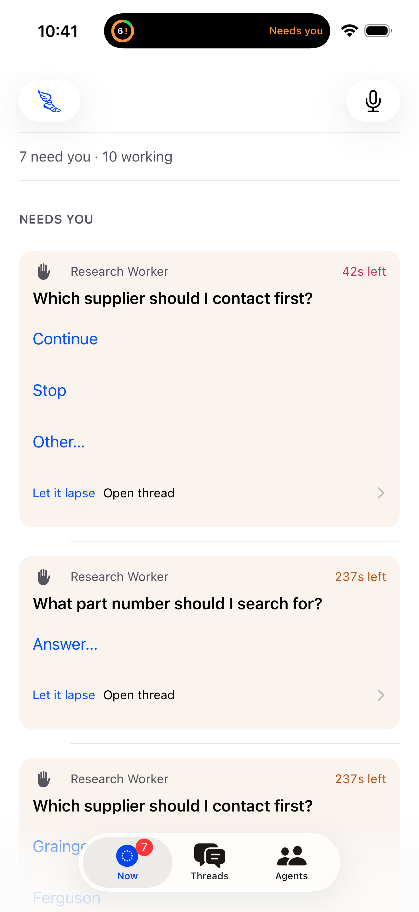
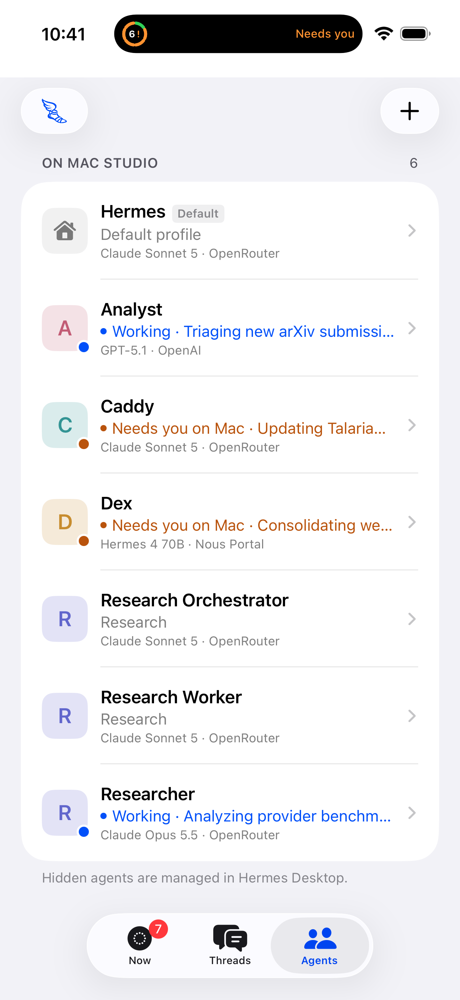

# Talaria

**Hermes on your Mac, in your pocket.**

Talaria is a native iPhone companion and control surface for Hermes. Hand work to
Hermes, leave it running on your Mac, and check, steer or stop it from your phone
through a private authenticated bridge. Hermes owns the runtime and history.

[Install](docs/INSTALL.md) · [Use Talaria](docs/USING_TALARIA.md)
· [What changed](CHANGELOG.md) · [MAJOR//MINOR article](https://majorminor.xyz/releases/talaria)

**Current release: 0.2.1 / build 3.** Download the unsigned IPA and bridge package
from [v0.2.1](https://github.com/majorminorlabs/tools-talaria/releases/tag/v0.2.1),
or build source with Xcode. See the [physical acceptance record](docs/PHYSICAL_ACCEPTANCE_v0.2.0.md).

 

*Current simulator interface with synthetic fixtures; no live user data.*

## Current capabilities

- **In-app approvals:** approve once, approve for the session, or deny the exact
  Hermes command request; swipe Approve/Deny on Now. Requires Hermes server-request
  approvals (4bb9e57 or newer); older Hermes shows “Approve on your Mac.”

- **Now:** Needs You, working items, recent results and upcoming routines. Answer
  supported clarifications, review tasks, snooze requests or leave them for your desk.
- **Threads:** persistent streaming conversations, search, unread/pin/archive
  controls, Agent/source filters, tool steps, artifacts, follow-up, steer and Stop.
- **Agents:** native Hermes Bot Mode discovery and configuration, independent
  Ask threads, current work and recent threads. Change supported model defaults
  with locally recorded change/Revert controls; manage real routines.
- **Global Ask:** see the destination before sending. Auto routes to Hermes;
  explicit names/aliases select an Agent, with a choice for ambiguous matches.
  Choose supported model/provider, reasoning and project settings for a new thread.
- **Capture:** preserve text verbatim, links, Photos, Files, camera images and
  reviewed voice transcripts with audio. Captures survive relaunch locally and
  sync automatically to a dedicated private bridge inbox when reachable.
- **Safe offline behavior:** queued Asks require **Send now**. Uncertain delivery
  requires a read-only receipt check; commands never automatically replay.
- **Voice:** hold Ask to speak and send on release, slide down to lock or left to
  cancel. Capture and clarification answers require confirmation. Speech recognition
  prefers on-device processing; ordinary dictation/Ask sends text, not audio.
- **Live Activity:** one aggregate Lock Screen/Dynamic Island view of observed work,
  with running, needs-input and blocked priorities and links back to Threads.
- **Studio:** saved hosts, connection/settings, usage and capability-gated tools.
  Reconnect replays retained events or refreshes canonical snapshots after cursor expiry.

Configured Kanban boards, routines, media previews and optional Research Terminal
retrieval remain available. User-facing Agents are underlying Hermes bots/profiles;
independent Agent threads leave canonical Bot Chats intact. Capabilities depend on
the audited Hermes host. Dangerous tool approvals can be answered in-app when Hermes advertises exact approval server requests; legacy approvals stay on the Mac.

## Architecture and privacy

```text
Talaria / iPhone → private Tailscale HTTPS → hermes-mobile-bridge → Hermes / Mac
```

Provider credentials stay on the Mac; scoped bridge tokens use iPhone Keychain.
Capture is storage, not an instruction to run a task. Voice Capture sends its
reviewed transcript and M4A audio to your bridge; plain links are stored without
fetching them. Local queues and host capture storage contain private user data.
See [privacy and security](docs/PRIVACY_SECURITY.md).

## Requirements and installation

- iPhone with **iOS 18+**; **Xcode 26+** for current source builds.
- Awake, logged-in Mac with **Python 3.11+**, Hermes and the mobile bridge.
- Tailscale on both devices, private HTTPS and a policy permitting bridge access.
- Your own Apple signing identity, using Xcode or SideStore.

Follow [installation and pairing](docs/INSTALL.md). [Xcode](docs/XCODE_INSTALL.md)
installs current source. [SideStore](docs/SIDESTORE_USER_GUIDE.md) can install the
published 0.2.1 IPA; keep its normal Team-ID suffix and refresh free signing
before seven-day expiry. LocalDevVPN serves SideStore signing; restore Tailscale
for normal use. Keep the installed ID and Team stable for updates.

The public source identity is `xyz.majorminor.talaria`; the Live Activity extension
uses its `.LiveActivity` suffix. Self-builders can choose a unique identity via
`TALARIA_APP_BUNDLE_ID` in ignored local configuration. The project/scheme retain
technical names **Hermes**. The bridge targets audited Hermes commit
`4bb9e57bfde8a0affb5553eff13ed6e1f14147f1`, with reduced legacy support for
`2a4c9afd7bd`; arbitrary newer versions are not automatically trusted.

## Limits and documentation

No APNs delivery or guaranteed monitoring while iOS suspends Talaria. Live Activity
updates depend on the app running and become stale; they do not keep the bridge
connection alive. Physical 0.2.0 acceptance passed; iOS 18 runtime remains unverified. There is no mid-thread model switching, Agent pause/reasoning-default
control, structured decision system, tracked delegation, TTS or widgets beyond the
Live Activity extension. Review-note plus task transition uses two upstream operations.

- [User guide](docs/USING_TALARIA.md) · [Troubleshooting](docs/TROUBLESHOOTING.md).
- [Mac service setup](docs/STUDIO_SETUP.md) · [Develop and test](docs/DEVELOPING.md).
- [Release readiness](docs/RELEASE_READINESS.md) · [Packaging](RELEASE.md).
- [Bridge API](BRIDGE_API.md) · [Current architecture](UI_ARCHITECTURE.md).
- [Phase 1 implementation](docs/design/TALARIA_VNEXT_PHASE1_IMPLEMENTATION.md)
  · [Live Activity](docs/design/TALARIA_LIVE_ACTIVITY.md).

The vNext design is a roadmap; planned Phase 2 items are not shipped features.
Historical validation reports describe their named revisions, not current acceptance.
Report issues through [GitHub Issues](https://github.com/majorminorlabs/tools-talaria/issues)
with private tokens, hostnames and conversation content removed.

[MIT](LICENSE), by MAJOR//MINOR. See [third-party notices](THIRD_PARTY_NOTICES.md).
