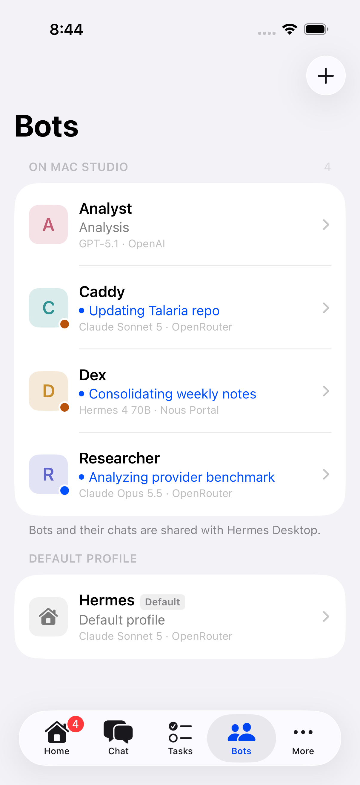
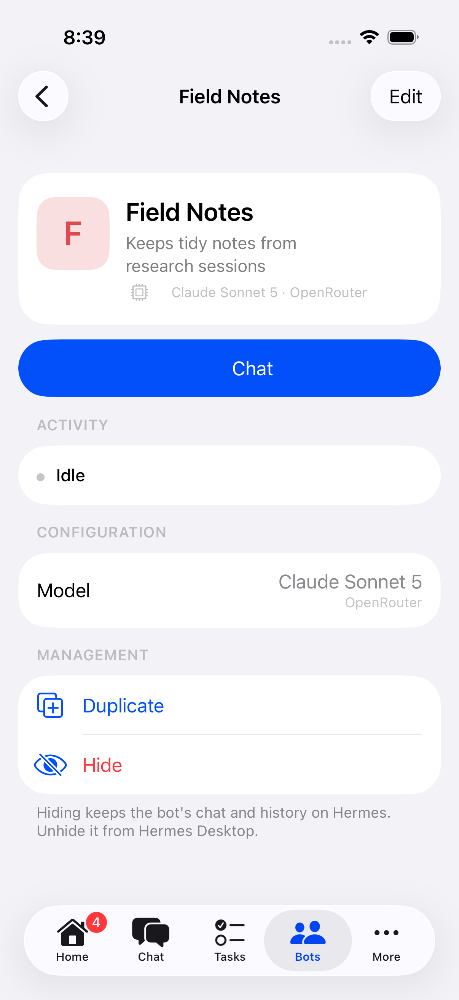

# Talaria

Talaria is MAJOR//MINOR's open-source, self-hosted iPhone companion for Hermes running on your Mac. Hermes runs
the agents and keeps their records; Talaria provides chat, bots, tasks and status
through a private authenticated bridge.

**v0.1.0 is an early personal-install release.** It is not available on the App
Store. Its permanent public IPA bundle identifier is `xyz.majorminor.talaria`.
Install from source with Xcode and your own Apple Developer Team, or re-sign the
published IPA with SideStore. Both routes need Hermes and hermes-mobile-bridge
on your Mac; SideStore is optional.

```text
Talaria on iPhone → private Tailscale HTTPS → hermes-mobile-bridge → Hermes on Mac
```

## What works

- Persistent conversations, streaming replies, tool/activity history, stop and steer.
- Hermes Bot Mode: dynamic discovery, canonical writable bot chats, create/edit,
  duplicate and hide. Native Hermes profiles remain the source of truth.
- Tasks, routines, configured Kanban boards, usage and current run status.
- Files, Photo Library and new Camera captures with attachment previews.
- Native speech-to-text into the editable composer; microphone audio stays out
  of the Hermes bridge.
- Reconnect/replay, foreground reconciliation and cached last-known state offline.
- Research Terminal retrieval/search when the host skill and credentials are configured.
- Talaria branding, light/dark appearances and accessible Markdown tables.

Features are capability-gated by the host. Dangerous tool approvals remain
Studio-only because the audited Hermes protocol cannot safely target them.

## Requirements

- macOS host with Python 3.11+ and an existing, prepared Hermes installation.
- Full Bot Mode/media support was tested against Hermes commit
  `4bb9e57bfde8a0affb5553eff13ed6e1f14147f1`. The bridge also supports the audited
  legacy `2a4c9afd7bd` contract with fewer capabilities; arbitrary newer versions
  are not automatically trusted.
- Tailscale on Mac and iPhone, MagicDNS/HTTPS and an access policy permitting
  the phone to reach the host on TCP 443. Serve stays private; Funnel is unused.
- iOS 18+, Xcode 26+ for development, and your own Apple signing identity for
  personal installation. SideStore can re-sign the unsigned IPA.

## Install

Choose either installation method. Both connect to the same self-hosted backend:

```text
Hermes on Mac → hermes-mobile-bridge → private Tailscale HTTPS → Talaria on iPhone
```

### Option A: Xcode / Apple Developer

1. Clone `https://github.com/majorminorlabs/hermes-talaria.git` and open
   **Hermes.xcodeproj**. The Talaria app target and scheme are named **Hermes**.
2. Select that app target → **Signing & Capabilities**, enable automatic signing,
   and choose your own Apple Developer Team.
3. If needed, change the bundle identifier to one your Team can register, such
   as `com.example.talaria` or a reverse-DNS ID based on a domain you control.
4. Connect and unlock your iPhone, select it as the run destination, then
   **Product → Run** to build and install Talaria.
5. Install/configure hermes-mobile-bridge on the Mac that runs Hermes, then pair
   Talaria using the shared [bridge setup and pairing guide](docs/INSTALL.md#mac-bridge-setup).

**SideStore is not needed for this route.** A free Apple Account's **Personal Team**
works for personal-device testing but expires after seven days and needs rebuilding
and reinstalling. Paid Apple Developer Program membership uses normal development
provisioning without the free Personal Team's weekly limit; check the actual
profile expiration. See the practical [Xcode installation guide](docs/XCODE_INSTALL.md)
and [Apple's account overview](https://developer.apple.com/help/account/basics/about-your-developer-account).

The canonical project/release bundle ID, `xyz.majorminor.talaria`, identifies the
MAJOR//MINOR release. A unique self-build ID is normal: Talaria's Keychain service
uses its **actual runtime bundle ID**, not a required literal canonical ID. A
changed ID creates a distinct iOS app with separate local preferences/container
and no automatic Keychain sharing. New installs simply pair with the bridge.
Use your own Team and signing material; never copy the publisher's credentials.

### Option B: SideStore

Use [official SideStore](https://docs.sidestore.io/docs/installation/install) if you
prefer personal sideloading without maintaining an Xcode build/install workflow.
Paid developer membership is not required. Import **Talaria-v0.1.0.ipa** from the
[v0.1.0 release](https://github.com/majorminorlabs/hermes-talaria/releases/tag/v0.1.0),
keep SideStore's normal Team-ID suffix behavior, then pair with the same Mac bridge.
An installed ID such as `xyz.majorminor.talaria.<YOUR TEAM ID>` is expected.

**LocalDevVPN is for SideStore installation/refresh. Tailscale is for Talaria ↔
Hermes bridge connectivity.** Switch back to Tailscale for normal Talaria use.
With free-account signing, refresh before the seven-day profile expires.

Follow the detailed [SideStore user guide](docs/SIDESTORE_USER_GUIDE.md) for initial
setup, import, verification, VPN switching, account limits and weekly Refresh All.
SideStore has extensive physical update/refresh testing; the guide distinguishes
those results from stock-build and second-account behavior not yet tested.

[Installation](docs/INSTALL.md) compares both routes and provides one canonical
bridge/pairing procedure. [Mac service setup](docs/STUDIO_SETUP.md) covers ownership,
restart and backup.

## Develop and test

Open `Hermes.xcodeproj`, select the **Hermes** scheme and an iPhone simulator.
The Xcode project/targets retain technical Hermes names. Normal launch uses the
Studio bridge; explicit Simulation mode and test fixtures are separate.

```sh
xcodebuild -project Hermes.xcodeproj -scheme Hermes \
  -destination 'platform=iOS Simulator,name=iPhone 17 Pro' \
  -parallel-testing-enabled NO test
cd hermes-mobile-bridge
python3 -m venv .venv
.venv/bin/python -m pip install -e '.[test]'
.venv/bin/python -m pytest -q
```

Personal signing belongs in ignored `Signing.local.xcconfig`; copy
`Config/Signing.example.xcconfig` and set your Team locally. The current shared build configuration and release artifacts contain no personal
Team, certificate or provisioning material. Public distribution uses a separate
fresh-root repository; see [public release handoff](docs/PUBLIC_RELEASE_HANDOFF.md).

## Documentation and limits

- [Release notes](CHANGELOG.md), [packaging](RELEASE.md) and
  [release readiness](docs/RELEASE_READINESS.md).
- [Troubleshooting](docs/TROUBLESHOOTING.md).
- [Bot management](BOT_MANAGEMENT.md), [attachments and voice](ATTACHMENTS_AND_VOICE.md).
- [Design](TALARIA_DESIGN.md), [UI architecture](UI_ARCHITECTURE.md),
  [integration points](INTEGRATION_POINTS.md) and [bridge contract](BRIDGE_API.md).
- [Physical acceptance](PHYSICAL_DEVICE_TEST_REPORT.md) and
  [post-design regression evidence](TALARIA_REGRESSION_VALIDATION.md).

No APNs delivery or guaranteed execution while iOS suspends the app. The Mac must
be awake, logged in and reachable on the tailnet. Some inventories/settings remain
unavailable, and independent native clients can conflict with live transport
ownership. Free Personal Team provisioning expires after seven days: rebuild/reinstall with
Xcode or refresh with SideStore, according to your chosen method. Use the
[installation guides](docs/INSTALL.md) for signing and connection details.

## License

[MIT](LICENSE). Third-party components keep their own licenses; see
[notices](THIRD_PARTY_NOTICES.md). Nothing is pushed, tagged or published by the
release scripts.

## Screenshots

Simulator screenshots with fictional demonstration bots; no live account data.

 

## Start here

1. [Install and pair](docs/INSTALL.md): Mac service, Tailscale, iPhone installation and host enrollment.
2. [Use Talaria](docs/USING_TALARIA.md): chat, bots, media, dictation, tasks and research.
3. [Build/install with Xcode](docs/XCODE_INSTALL.md) or [install/refresh with SideStore](docs/SIDESTORE_USER_GUIDE.md).
4. [Diagnose a problem](docs/TROUBLESHOOTING.md).
